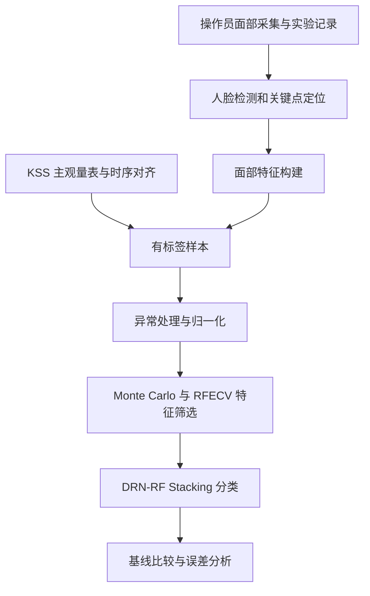

# 控制室操作员疲劳识别｜DRN-RF 论文展示

**Integrating DRN-RF with computer vision for detection of control room operator’s mental fatigue**

PLOS ONE 20(4), e0320780 (2025) · [正式论文](https://doi.org/10.1371/journal.pone.0320780)

[在线方法导览与指标计算器](https://jiangenjing.github.io/drn-rf-fatigue-research/)

本仓库把“视频中的面部变化”到“疲劳类别判断”的研究链路拆开说明，便于理解标签、特征处理、特征筛选、集成分类和评估之间的关系。适合先了解方法，再规划严格复现；目前不是开箱即用的摄像头疲劳识别软件。

## 阅读导航与演示任务

**建议阅读顺序：** [方法结构](#方法结构) → [系统架构](#系统架构数据标签与模型怎样连接) → [个人贡献与论文结果](#论文结果与个人贡献) → [指标计算器](#如何操作-demo怎样解释指标) → [复现路线](#从论文展示走向可复现实验)。前四部分建立方法概念，后续章节用于实验设计和排错。

| 你想了解什么 | 建议操作 | 应得到的理解 |
| --- | --- | --- |
| 疲劳如何成为标签 | 阅读 KSS 与采样时间说明 | 标签、帧和受试者不是同一种数据单位 |
| 模型从图像中使用什么 | 沿检测、定位、特征、分类链路阅读 | 68 点定位不是最终疲劳判断 |
| 为什么准确率不够 | 在计算器中增大 FN，观察 Recall | 漏检疲劳的风险不能被大量 TN 掩盖 |
| 怎样继续研究 | 查支持材料与复现验收清单 | 先恢复数据和划分，再训练和比较模型 |

**教学例子：** 若 TP=40、FP=10、FN=20、TN=130，则准确率为 85%，但疲劳召回率约为 66.7%。这组人为构造的数据用于解释评价口径，不是论文实验数据。产品设计上，“什么时候提醒、由谁复核、误报后如何处理”与分类分数同样重要；当前 Demo 只演示方法和指标，不承担现场预警。

## 研究目标

将面部视觉特征与主观疲劳标签结合，探索操作员疲劳状态的分类方法，为工业场景中的状态监测提供研究依据。它不是医疗诊断系统，也不是已上线的安全控制产品。

## 方法结构

1. 使用 KSS 量表形成疲劳标签，整理样本。
2. 基于 Dlib 的人脸检测与 68 点关键点定位得到面部几何信息。HOG 用于检测流程，不能简单说“HOG 直接输出 68 点”。
3. 进行 3σ 异常处理与 Min-Max 归一化。
4. 结合 Monte Carlo 与 RFECV 选择特征。
5. 以 DRN 与 RF 形成两层 Stacking，并与 ANN、GBM、KNN、RF 等基线比较。

Stacking 的关键是使用折外预测训练第二层，不能把第一层对自身训练样本的拟合结果直接当作可靠验证表现。预处理与特征选择也应仅在训练折拟合；跨人泛化需要按受试者划分验证，不能只看随机帧划分的高分。

## 系统架构：数据、标签与模型怎样连接？



图中概括论文方法。真正复现时必须先划分训练/验证/测试集合，再在训练部分拟合数据处理器，不能把上述流程理解成“先用全量数据筛特征，再随机切测试集”。

### 1. 标签：KSS 描述主观困倦，不是天然的绝对真值

KSS 为主观量表。复现需要核对打分时刻、图像采样时间和类别映射。若将一次评分关联到一段视频，其相邻帧高度相关；把相邻帧分别放入训练和测试，会使结果过于乐观。

因此最先需要确认的不是网络层数，而是：一个样本是单帧还是时间窗口？类别怎样划分？同一受试者是否同时出现在多个集合？标签是否存在延迟或噪声？

### 2. 视觉特征：检测、定位和分类不是同一步

| 环节 | 输入 | 输出 | 需要核验的条件 |
| --- | --- | --- | --- |
| 人脸检测 | 图像 | 人脸区域 | 遮挡、侧脸、照明及检测失败 |
| 关键点定位 | 人脸区域 | 68 个关键点坐标 | 关键点丢失和几何合理性 |
| 特征构造 | 坐标与相关视觉信息 | 模型使用的特征向量 | 特征定义、单位、是否受头部姿态影响 |
| 分类 | 处理后的特征 | 疲劳类别或分数 | 阈值、泛化范围、漏检与误报 |

HOG 参与人脸检测流程，不应写成“HOG 直接生成 68 个关键点”。关键点存在也不意味着模型在真实工业环境下已经可靠运行。

### 3. 预处理：每个统计量都有适用范围

Min-Max 归一化可表示为：

$$z_j=\frac{x_j-\min_{train}(x_j)}{\max_{train}(x_j)-\min_{train}(x_j)}.$$

最大值和最小值应来自训练集合；常数特征要单独处理。3σ 异常处理也应说明使用哪些统计量、删除或修正多少样本，以及是否误删了真正的疲劳极端样本。

### 4. 特征选择：先判断“什么有用”，再讨论“模型有多深”

RFECV 在递归移除特征的同时，通过交叉验证比较特征子集。Monte Carlo 重复抽样可以用于考察选择过程对样本变化的敏感性。其具体抽样次数、划分比例、估计器和评分函数需要从论文及原配置核对，不能由算法名称反推。

若在同一验证集上反复挑选特征，再把该验证集结果当成最终泛化指标，会产生选择偏差。可用独立测试集或嵌套验证控制这一风险。

### 5. Stacking：核心是信息如何跨层流动

DRN-RF 不是把两个模型名并列即可。解释该结构时，需要说清第一层产生什么输出、第二层接收什么输入，以及训练元模型时如何得到折外预测。

一个规范的学习示意是：训练折拟合第一层 → 对该折未参与训练的样本产生预测 → 汇总 OOF 特征训练第二层 → 在未参与调参的测试集评估。这个示意说明防泄漏原则，不宣称仓库已经恢复论文的层数、超参数和训练过程。

## 论文结果与个人贡献

论文报告最终模型准确率 **94.2%**、结果偏差 **0.004**。这是论文实验结论，不是仓库当前重跑结果；偏差不在这里擅自改写为置信区间或标准差。

Enjing Jiang 是论文第三位作者。公开 CRediT 包括 Conceptualization、Data curation、Project administration、Visualization、Writing – original draft；不据此宣称独立实现了全部模型。

## 展示页与可用材料

打开 `index.html` 可交互阅读方法流程。附带的混淆矩阵计算器仅使用明确标注的**教学示例计数**，用于理解 Precision / Recall / F1 / Accuracy，不是论文原始混淆矩阵。

目前未取得原训练源码、权重和完整环境，因此不提供伪装成原实现的摄像头识别 Demo。

找回了出版社提供的 [S1 Supporting Information](https://doi.org/10.1371/journal.pone.0320780.s001)。应先检查其中的数据结构、使用条件和被试隐私，再确定能复现哪些实验；附件存在不等于本仓库已完成下载、训练或复现。

## 后续复现验收

- 核对样本单位、受试者 ID、KSS 到类别的映射。
- 明确按受试者划分还是按样本划分，防止同人信息泄漏。
- 在每个训练折内拟合归一化、异常处理及特征选择。
- 保存折外预测、随机种子、每折指标及模型配置。
- 报告类别不均衡下的宏平均 F1、召回率及混淆矩阵，而不只报告准确率。

## 如何操作 Demo、怎样解释指标？

页面上半部分用按钮切换方法环节，下半部分提供教学用二分类混淆矩阵。可以改变 TP、FP、FN、TN，理解为什么只看准确率会遗漏风险。

$$Precision=\frac{TP}{TP+FP},\quad Recall=\frac{TP}{TP+FN},\quad F1=\frac{2TP}{2TP+FP+FN}.$$

$$Accuracy=\frac{TP+TN}{TP+FP+FN+TN}.$$

在疲劳监测语境下，假设“疲劳”为正类，FN 表示漏掉疲劳，FP 表示把清醒误判为疲劳。两者业务代价不同。若论文使用多分类，应采用每类指标、宏平均等合适口径，不能把教学二分类计算器当成原实验评价表。

### 本地查看

```bash
git clone https://github.com/jiangenjing/drn-rf-fatigue-research.git
cd drn-rf-fatigue-research
python3 -m http.server 8000
```

访问 `http://localhost:8000/`；也可直接打开 `index.html`。页面不需要摄像头权限，不传输人脸数据，也不需要 API Key。

## 从论文展示走向可复现实验

| 工作包 | 最少需要什么 | 交付物 |
| --- | --- | --- |
| 数据核对 | 支持材料、字段定义、受试者与标签信息 | 数据字典与合法使用边界 |
| 处理管线 | 缺失/异常处理规则、特征公式 | 只在训练折拟合的处理代码 |
| 模型实现 | DRN 配置、RF 配置、层间接口 | 固定随机种子与依赖的训练脚本 |
| 基线复现 | 同一数据划分与调参预算 | ANN、GBM、KNN、RF 的公平对照 |
| 泛化检查 | 独立受试者或独立场景 | 每类指标、误差案例和置信区间 |
| 部署研究 | 推理性能与隐私安全设计 | 不参与生产安全控制的受控测试 |

这些是下一阶段的验收要求，不是已完成清单。对于操作员监测，还需考虑知情同意、数据最小化、访问控制和误报后的人工复核；不能直接将研究模型当成处罚或安全决策依据。

## 常见问题

**为什么不提供“打开摄像头立刻识别”的按钮？** 缺少训练源码和可靠权重时，临时用阈值分类器冒充 DRN-RF 会误导访问者。

**94.2% 是否意味着工业现场只有 5.8% 错误？** 不能这样解释。论文指标受样本、划分、场景与评价口径限制，现场分布变化可能显著影响结果。

**这个项目体现什么能力？** 对数据和实验过程的组织、对视觉特征与集成分类的理解，以及把论文结果、个人贡献和复现证据分开表达的能力。

## 技术阅读补充：怎样做可信的模型比较？

对这一研究，数据划分的优先级高于网络结构选择。同一受试者的相邻视频帧具有相似光照、姿态和面部特征。若目标是推广到从未见过的人，测试集合就应包含未参与训练的受试者；若目标是同一人的后续状态监测，则需要时间边界清晰的验证方案。这是两种不同的问题，结果不能混成一个泛化数字。

预处理、特征选择和模型训练应作为同一条管线管理。训练折拟合归一化统计量和特征子集，再应用到验证折；最后的测试集不参与选择。可参考 [scikit-learn 数据泄漏与预处理指南](https://scikit-learn.org/stable/common_pitfalls.html)。这一资料补充的是通用实验规范，不是对论文具体实现的额外结论。

进一步实验可以先固定数据划分，分别比较“不做特征筛选”“只用 RF”“加入 DRN”“完整 Stacking”。只有控制其他条件，才能讨论性能差异可能来自哪个组件。随机森林的树数量、深度，网络的训练轮次，以及不同基线的调参预算都应记录；使用更多计算资源的模型，不宜直接被解释为方法本身更优。

最终报告应包含错误类型。例如，遮挡导致关键点不稳定属于输入质量问题；疲劳与清醒边界样本可能反映标签不确定性；新受试者普遍表现较差可能提示身份特征过拟合。对应改进分别是采集质量控制、标签复核和跨人验证，不能一律归结为“换更大的模型”。本节是后续实验设计，不新增当前仓库的实测成绩。

## 引用

Ji Z, Xie X, Jiang E, Wang Y, Min B, Yang S, et al. (2025). 上述论文. PLOS ONE 20(4): e0320780. https://doi.org/10.1371/journal.pone.0320780 。论文为开放获取；本仓库页面是方法解读，不是论文源码。
